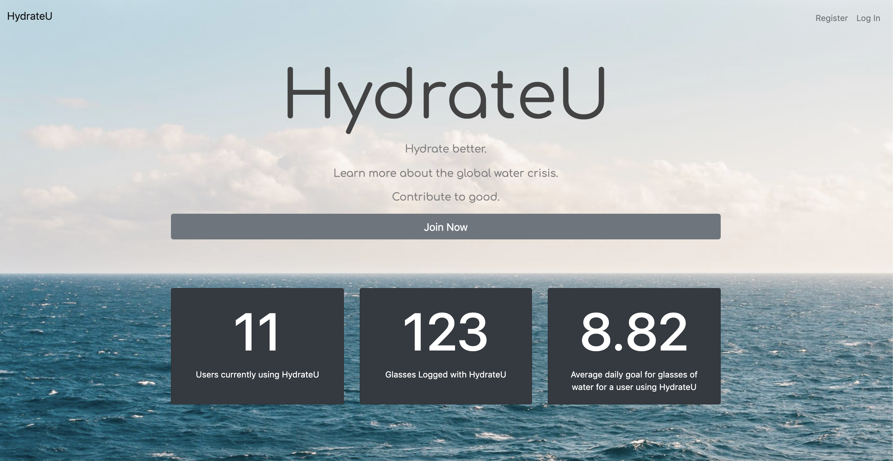

# HydrateU

*HydrateU* was created as a final project for Yale's CS50 introductory computer science course. It is a website designed for the user to keep track of their hydration by recording daily glasses, setting hydration goals for that day, seeing a "calendar" of the glasses they have logged, as well as having access to their hydration statistics such as days they have met their goal, days they have not, and other relevant statistics. 



The site also includes webpages for the user to educate themselves on the global water crisis, as well as another menu to learn more about organizations in the space and donate if the user wishes.

## Installation

HydrateU is currently housed on the CS50 IDE, but can be run locally. To begin running the application where it is stored, clone all required files and in the requisite directory, run,

```bash
flask run
```
This will create a temporary server where you can see HydrateU. 

## Usage

HydrateU is a Python Flask application which uses HTML/CSS (Bootstrap). 

A few of the files with pertinent information include:

 - Static
	 - `images`, with the images the site has
	 - `styles.ccs`, the CSS file the website uses for style
        
 - Templates
	 - All of the webpage templates the site renders, including `layout.html`
    - `application.py`, where the Python code running the backend is stored
    - `helpers.py`, where helper functions like "apology" are stored
    - `hydrateU.db`, a database configured with SQLite
	     - Keeps track of user passwords/hashing, daily goals by day, glasses drank, and more
        
For a user to use the site, they must register using the register webpage (their information is then saved to the users table). They can then
login to the site using the login tab, where their credentials are checked using `application.py` and `hydrateU.db`.
